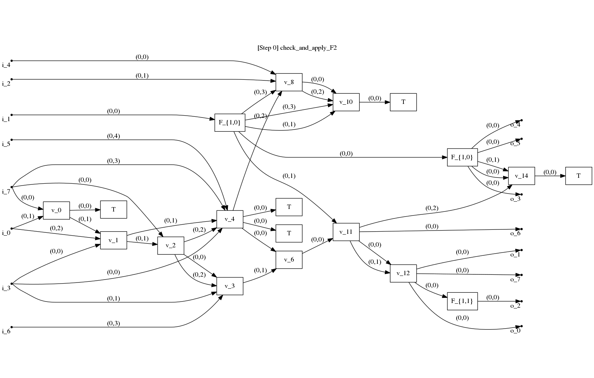
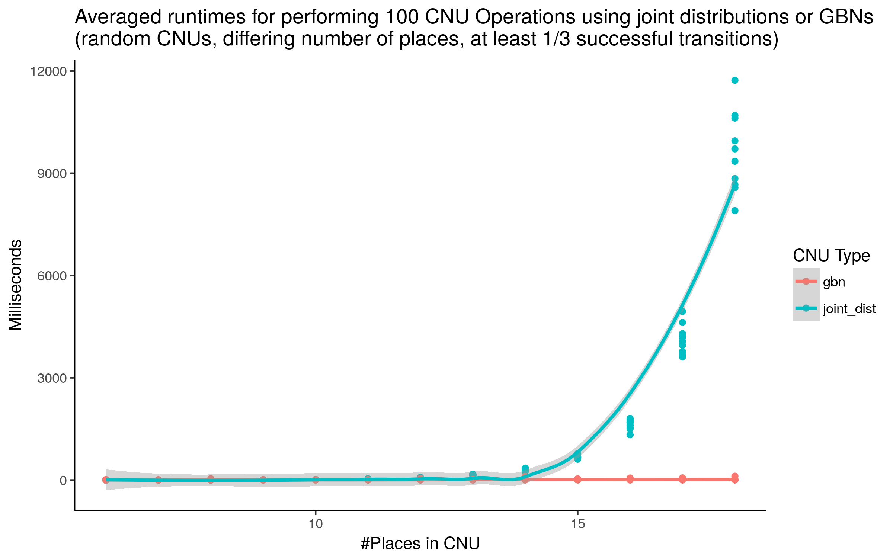
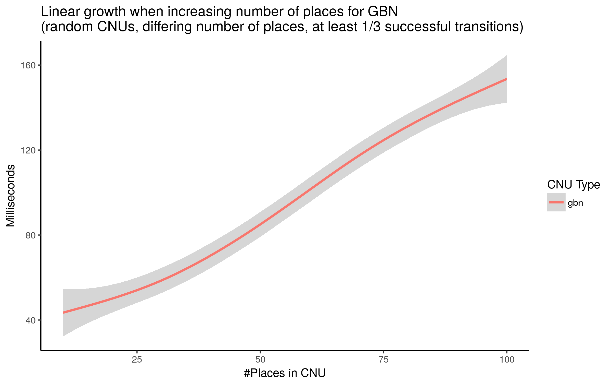

# Updating Probabilistic Knowledge on Condition/Event Nets using Bayesian Networks

This repository contains the implementation and experimental results for the article *"Uncertainty Reasoning for Probabilistic Petri Nets via Bayesian
Networks"* submitted to *Concur '20*. 

## Abstract 
This paper exploits extended Bayesian networks for uncertainty
reasoning on Petri nets, where firing of transitions is
probabilistic. In particular, Bayesian networks are used as symbolic
representations of probability distributions, modelling the
observer's knowledge about the tokens in the net. The observer
can study the net by monitoring successful and failed steps.

An update mechanism for Bayesian nets is enabled by relaxing some of
their restrictions, leading to modular Bayesian nets that can conveniently be represented and modified by
viewing them through the lens of the categorical notion of a PROP.
As for every symbolic representation, the question is how to derive
information -- in this case marginal probability distributions --
from a modular Bayesian net. We show how to do this by generalizing
the known method of variable elimination.

The approach is illustrated by examples about the spreading of
diseases (SIR model) and information diffusion in social
networks. We have implemented our approach and provide runtime
results.

## Program
This repository extends the git repository https://github.com/bencabrera/bayesian_nets_program by adding the option for probabilistic transitions amongst other things. It implements CNUs and GBNs as described in the paper. In order to show the advantage of modelling CNUs with GBNs we implemented the option of calculating the marginal probability of a specific place in the GBN. In order to have a reference for comparing runtimes we also used a variant of CNUs using a simple joint distribution as the underlying model to store probabilities.
Mostly for development purposes there are also functions to load, save, draw and randomly generate GBNs.

GBNs are visualized using GraphViz.
Vertices visualized as small dots and labelled with `i_...` or `o_...` symbolize inputs and outputs of the GBN. Edges are labeled with tuples representing the ports of source and target vertex the edge is connected to.

### CNU Operations modelled by a GBN
The following GIF shows the transformation of the GBN during the running CNU example of the paper. We start with the initial GBN and add vertices according to the successful firing of transition t4 (t3 in the program, since numbering starts at 0) and the failure of firing t1 (t0 in the program). Finally we once call the simplification command to reduce the complexity of the GBN by applying the local and global simplifications described in the paper.

  

### Evaluations of GBNs
The next GIF is meant to give an impression of how the simplification of an arbitrary GBN works. To this end we start with a randomly generated GBN with 8 input, 8 outputs and 15 inside vertices to start with. 
Simplifications are then performend by trying (in this order) to apply simplifications called
1. (CoUnit), 
2. (F1) - (F5), 
3. (split_vertex_if_multiple_outputs), 
4. (simplify_matrix_for_duplicate_inputs), 
5. (eliminate_stochastic_vertex_without_outputs), 
6. (switch_substoch_to_front), 
7. (normalize_substoch_front_vertices_without_inputs).

Whenever one of these simplification steps was successfully applied we restart from the beginning. The simplification is complete if none of the above simplification steps can be applied anymore.

### Runtime Results

We performed some basic runtime tests to give an indication of the performance gain that can be archieved by using GBNs. To this end, we compared implementations of the CNU operations with a joint distribution tables as backend and GBNs as backend. The results in the following plot show the expected exponential blow up for increasing the number of places of the naive implementation using joint distributions. The GBN implementation stays relatively constant. 

The data was generated by generating random CNU instances with a certain number of places. Then transitions were fired at random and the result propagated to the joint distribution tabel / GBN.
This process was repeated 100 times and the average is reported in the plot.

*Note:* It is important to note that the random sampling of transitions did not occur uniformly at random but was skewed to enforce a certain number of succesful transitions (in the case of the plot 33.3%). That is because for randomly generated CNU instances most of the transitions fail which then introduces a lot of F-matrices into the GBN. Currently, there are no simplifications implemented for joining F-matrices which is why this considerably slows down the GBN approach when a lot of F-matrices are introduced. However, we think it is reasonable to assume a certain number of succesful transitions for a realistic scenario. 

  

The next plot is to show that for the scenarios considered the GBN approach further scales linearly in the number of places. This is because for the case of 1/3 succesful transitions the GBN stay relatively uncoupled in the sense that connected components in the graph stay relatively small (< 10) vertices.

   

## Installation

In principle the program can be compiled on any unix-based system. The programs only depend on the boost library (which has to be installed) and the cmake file can be used to generated Makefiles for compilation.

More detailed instructions: tbd.
