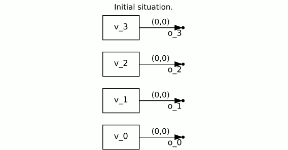
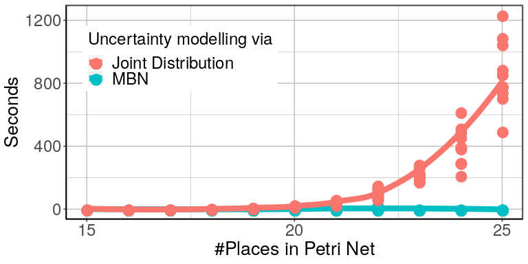
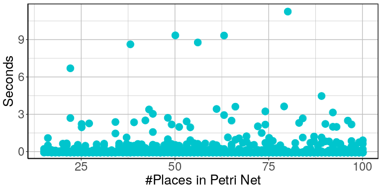

# Updating Probabilistic Knowledge on Condition/Event Nets using Bayesian Networks

This repository contains the implementation and experimental results for the article *"Uncertainty Reasoning for Probabilistic Petri Nets via Bayesian
Networks"* submitted to *Concur '20*. 

## Abstract 
This paper exploits extended Bayesian networks for uncertainty
reasoning on Petri nets, where firing of transitions is
probabilistic. In particular, Bayesian networks are used as symbolic
representations of probability distributions, modelling the
observer's knowledge about the tokens in the net. The observer
can study the net by monitoring successful and failed steps.

An update mechanism for Bayesian nets is enabled by relaxing some of
their restrictions, leading to modular Bayesian nets that can conveniently be represented and modified by
viewing them through the lens of the categorical notion of a PROP.
As for every symbolic representation, the question is how to derive
information -- in this case marginal probability distributions --
from a modular Bayesian net. We show how to do this by generalizing
the known method of variable elimination.

The approach is illustrated by examples about the spreading of
diseases (SIR model) and information diffusion in social
networks. We have implemented our approach and provide runtime
results.

## Program
This repository extends the git repository https://github.com/bencabrera/bayesian_nets_program by adding the option for probabilistic transitions amongst other things. It implements CNUs and GBNs as described in the paper. In order to show the advantage of modelling CNUs with GBNs we implemented the option of calculating the marginal probability of a specific place in the GBN. In order to have a reference for comparing runtimes we also used a variant of CNUs using a simple joint distribution as the underlying model to store probabilities.
Mostly for development purposes there are also functions to load, save, draw and randomly generate GBNs (GBNs = MBNs).

GBNs are visualized using GraphViz.
Vertices visualized as small dots and labelled with `i_...` or `o_...` symbolize inputs and outputs of the GBN. Edges are labeled with tuples representing the ports of source and target vertex the edge is connected to.

### CNU Operations modelled by a GBN and Evaluation
The following GIF shows the transformation of a GBN incorporating the observation of two probabilistic success cases and computing the probability that place K3 (v_2 in the program, since numbering starts at 0) is marked. The enabled transitions along with their designated probabilities are explained in the gossip example of the paper (but here, we observe two success cases instead of only one).
According to the values in the paper, either transition s1, s2 or s3 were fired. This gets incorporated by adding "successp" nodes into the network, which couple all places of the corresponding pre- and post-conditions.
Subsequently, we choose to evaluate only place K3 (respective v_2) by adding Terminator nodes to all irrelevant wires. We then delete the part of the network that is not relevant to evaluating K3 and finally collapse the network step by step.

  

### Runtime Results

We performed some basic runtime tests to give an indication of the performance gain that can be archieved by using GBNs. To this end, we compared implementations of the CNU operations with a joint distribution tables as backend and GBNs as backend. The results in the following plot show the expected exponential blow up for increasing the number of places of the naive implementation using joint distributions. The GBN implementation stays relatively constant. 

The data was generated by generating random CNU instances with a certain number of places. Then up to 3 transitions were picked at random and assigned a probability each. According to such a set of transition/probability pairs, either success or failure was observed. These results propagated to the joint distribution table / GBN.
This process was repeated 10 times and the average is reported in the plot.

  

The next plot is to show that even for a large number of places, the MBN approach still holds up. These cases are not feasible any more for the direct computation of joint distributions, due to memory problems.

   

The advantage of our approach decreases when we have substantially more places in the pre- and post-set, more transitions that may fire and a larger number of steps, since then the Bayesian network is more densely connected and contains larger matrices.

## Installation

In principle the program can be compiled on any unix-based system. The programs only depend on the boost library (which has to be installed) and the cmake file can be used to generated Makefiles for compilation.